# SaaS Contract Auditor

[](https://github.com/saxxi/saas-contract-auditor/actions/workflows/ci.yml)
[](LICENSE)
[](https://www.python.org/)
[](https://nodejs.org/)

**[View the project website](https://saxxi.github.io/saas-contract-auditor/)**

An AI-powered tool that **compares SaaS contract limits against real account usage data** to surface revenue opportunities. You give it structured account data (usage metrics, billing info, contract terms) and it tells you which accounts are ready for upsell, need renegotiation, or show signs of churn.

Built for account executives, customer success teams, and revenue operations at any B2B SaaS company managing a portfolio of client contracts.

> **Note:** This tool analyzes structured account data, not legal document text. It is not a contract clause parser or blockchain smart contract auditor.

### Homepage


### Demo Dashboard


### Report Detail


## How It Works

1. **Input**: Paste or load account data (seats used vs. limit, API calls, MRR, renewal date, payment status)
2. **Analysis**: An LLM compares usage against contractual limits, computes utilization rates, and identifies mismatches
3. **Output**: Each account gets a classification + a consulting-grade report with recommendations and a sales script

## What It Does

- **Upsell detection**: Accounts approaching or exceeding contract limits (>85% utilization)
- **Churn risk identification**: Low adoption, declining usage, poor engagement signals
- **Renegotiation signals**: Overages, overdue payments with high usage, mismatched billing terms
- **Account health classification**: Each account is classified as "upsell proposition", "requires negotiation", "poor usage", "at capacity", or "healthy"
- **Consulting-grade reports**: Situation/complication/resolution analysis, key metrics table, evidence from similar deals, risks and mitigants, next steps, objection handlers, and a tailored sales script
- **Bulk analysis**: Analyze your entire portfolio to find the best opportunities automatically
- **Interactive editing**: Refine reports via chat or inline editing before sharing with your team

Each report includes a success probability score (0-100), priority score (1-10), and an intervention flag for urgent accounts.

## Architecture

```mermaid
graph TD
    User([fa:fa-user User / Browser])

    subgraph Docker["Docker Compose"]
        direction TB

        subgraph Frontend["Next.js 16 Standalone"]
            UI["React 19 + CopilotKit UI"]
            API["REST API Routes"]
            Health["/api/health"]
        end

        subgraph Agent["LangGraph Agent"]
            Chat["CopilotKit Chat Handler"]

            subgraph ReportPipeline["Report Graph · Send() fan-out"]
                direction LR
                FanOut{"fan_out"}
                subgraph Parallel["process_account × N"]
                    direction TB
                    Fetch["Fetch data"]
                    LLM1["LLM: Analytical report"]
                    Val["Pydantic validate\n+ section rubric"]
                    Fix["LLM: Fix sections?"]
                    Audit["Numeric audit"]
                    LLM2["LLM: Sales script"]
                    Save["Save to DB"]
                    Fetch --> LLM1 --> Val --> Fix --> Audit --> LLM2 --> Save
                end
                FanOut -->|"account 1"| Parallel
                FanOut -.->|"account N"| Parallel
            end

            subgraph OppPipeline["Opportunities Graph"]
                OFetch["Fetch all summaries"] --> OLLM["LLM: Cross-portfolio\nclassification"] --> OVal["Pydantic validate\nOpportunitiesResult"]
            end

            Retry["invoke_with_retry\nsemaphore · max 5"]
        end

        AppDB[("PostgreSQL 17\nAccounts + Reports")]
        AgentDB[("PostgreSQL 16 + pgvector\nLangGraph State")]
        Redis[("Redis 6\nPub-sub Queue")]
    end

    User -->|"chat + actions"| UI
    UI -->|"CopilotKit"| Chat
    API <-->|"fetch / save"| Chat
    Chat --> ReportPipeline
    Chat --> OppPipeline
    API <--> AppDB
    Chat --- AgentDB
    Chat --- Redis
    Health -.->|"SELECT 1"| AppDB
    Health -.->|"ping"| Chat
    Retry -.->|"gates"| LLM1
    Retry -.->|"gates"| LLM2
    Retry -.->|"gates"| Fix
    Retry -.->|"gates"| OLLM

    style Docker fill:none,stroke:#555,stroke-width:2px
    style Frontend fill:#0d1f2d,stroke:#2196F3,stroke-width:2px,color:#e5e5e5
    style Agent fill:#1a0d24,stroke:#9C27B0,stroke-width:2px,color:#e5e5e5
    style ReportPipeline fill:#0d1a0d,stroke:#22c55e,stroke-width:1px
    style OppPipeline fill:#0d1a0d,stroke:#22c55e,stroke-width:1px
    style Parallel fill:#111,stroke:#3b82f6,stroke-width:1px,stroke-dasharray:5 5
    style Retry fill:#2e2e1a,stroke:#f59e0b,stroke-width:1px,stroke-dasharray:4 3
    style Health fill:#0d1f2d,stroke:#525252
    style FanOut fill:#1a1a2e,stroke:#3b82f6,color:#93bbfc
    style Val fill:#1a0d24,stroke:#a855f7,color:#d8b4fe
    style OVal fill:#1a0d24,stroke:#a855f7,color:#d8b4fe
    style Fix fill:#0d1a0d,stroke:#22c55e,stroke-dasharray:4 3
    style Audit fill:#2e2e1a,stroke:#f59e0b,stroke-dasharray:4 3,color:#fcd34d
    style LLM1 fill:#0d1a0d,stroke:#22c55e,color:#86efac
    style LLM2 fill:#0d1a0d,stroke:#22c55e,color:#86efac
    style OLLM fill:#0d1a0d,stroke:#22c55e,color:#86efac
```



The agent uses LangGraph's `Send()` API to fan out report generation across multiple accounts in parallel. Each fork runs a multi-step pipeline: LLM report, Pydantic validation, optional section fix, numeric audit, and sales script generation. All LLM calls are gated by a concurrency semaphore (default 5) and wrapped in retry-with-backoff. Results are collected via `operator.add` state reducers.

For a detailed walkthrough of the pipeline, data flow, and parallelism strategy, see the [full architecture page](https://saxxi.github.io/saas-contract-auditor/architecture.html).

## Tech Stack

| Layer | Technology |
|-------|-----------|
| Frontend | Next.js 16 (Turbopack), React 19, Tailwind CSS 4, CopilotKit, Recharts |
| AI Agent | LangGraph (Python), LangChain, CopilotKit SDK, OpenAI |
| Validation | Pydantic models for all LLM structured output |
| Database | PostgreSQL 17 + Drizzle ORM (app data), PostgreSQL 16 + pgvector (LangGraph state) |
| Queue | Redis 6 (LangGraph pub-sub for streaming) |
| Monorepo | Turborepo + pnpm workspaces |
| Python tooling | uv (package manager), pytest (tests), respx (HTTP mocking) |
| Deployment | Docker Compose (5 containers) |
| CI | GitHub Actions (matrix: Ubuntu/Windows, Node 22/24, Python 3.12/3.13) |

## Production Resilience

### LLM output validation

All LLM metadata is validated through Pydantic models:
- `ReportMetadata`: enforces `proposition_type` as a strict enum, `success_percent` (0-100), `priority_score` (1-10), `strategic_bucket`, `intervene` flag, `score_rationale`
- `OpportunitiesResult`: validates the recommended account IDs from portfolio analysis

On validation failure, a `with_structured_output()` fallback call extracts metadata from the report text, constrained to the Pydantic schema. This eliminates silent misclassification that previously defaulted to "healthy" at 50%.

### Retry with exponential backoff

`invoke_with_retry()` in `src/resilience.py` wraps all LLM calls:
- 3 retries with exponential backoff (1s, 2s, 4s)
- Catches `openai.RateLimitError`, `openai.APIError`, `httpx.TimeoutException`, `httpx.ConnectError`
- Each retry is logged via the structured tracing system
- Non-retryable errors propagate immediately

### Concurrency control

`asyncio.Semaphore` (default 5, configurable via `MAX_CONCURRENT_LLM` env var) gates all `model.ainvoke()` calls. Data fetching remains fully parallel; only LLM calls are serialized. This prevents rate-limit storms when fanning out across 50+ accounts.

### Report section validation

After the initial LLM pass, the pipeline checks for 9 required report sections (Executive Summary, Situation, Complication, Resolution, Key Metrics, Evidence, Risks, Next Steps, Key Question). If sections are missing, one focused re-prompt adds only the missing parts.

### LLM evaluator node (generate-then-verify)

After analysis, each report is scored by an LLM evaluator against a quality rubric using `with_structured_output(ReportEvaluation)`:
- **sections_complete**: all 9 required sections present and non-empty
- **metrics_accurate**: input metric values appear correctly in the report (LLM-verified, not string matching)
- **classification_justified**: proposition_type is consistent with the data signals
- **evidence_grounded**: historical deals referenced actually exist in the input
- **overall_quality**: `pass` / `marginal` / `fail`

On `fail`, the pipeline re-analyzes with the evaluator's issues as feedback (max 1 retry). On `marginal`, a warning is logged. Evaluation scores are also sent to Langfuse traces when configured.

### HTTP resilience

A shared `httpx.AsyncClient` with connection pooling and `httpx.AsyncHTTPTransport(retries=2)` replaces scattered per-request clients. Reduces connection overhead and adds transport-level retries for transient network errors.

### Health check and graceful degradation

- `GET /api/health`: checks DB (via `SELECT 1`) and agent (HTTP ping to LangGraph). Returns 200 with `"status":"ok"` or 503 with `"status":"degraded"` and per-component status. Used by Docker Compose healthcheck
- `GET /api/metrics`: proxies in-memory agent metrics (reports generated by type, errors, retries, average generation duration)
- CopilotKit route returns 503 with user-friendly message when agent is unreachable, instead of an unhandled 500

## Observability

### Structured JSON logging

The agent emits structured JSON logs for every operation via `src/tracing.py`. Each log entry includes a request ID, timing, and relevant context:

```
{"event":"report_start","request_id":"a1b2c3","account_id":"AC-1"}
{"event":"llm_retry","request_id":"a1b2c3","attempt":1,"delay":1.0,"error":"rate limited"}
{"event":"missing_report_sections","request_id":"a1b2c3","missing":["### Key Question"]}
{"event":"report_complete","request_id":"a1b2c3","duration_ms":1842,"proposition_type":"upsell proposition"}
```

Logs are written to stderr via Python's `logging` module. In Docker, they're captured by the container runtime. Set `LOG_LEVEL=DEBUG` for verbose output including cache hits and API call timing.

### In-memory metrics

Counters tracked in `tracing.py` and exposed via `GET /api/metrics`:
- `reports_generated_total` (broken down by proposition type)
- `report_generation_errors_total`
- `llm_retries_total`
- `report_generation_avg_duration_ms`

### LangSmith integration

LangSmith API key can be optionally passed for LangGraph trace visibility. Set `LANGSMITH_API_KEY` in environment or Docker Compose.

### Langfuse integration

Optional [Langfuse](https://langfuse.com/) integration for LLM-specific observability. When `LANGFUSE_PUBLIC_KEY` and `LANGFUSE_SECRET_KEY` are set:
- All LLM calls are automatically traced via Langfuse `CallbackHandler` (token counts, latency, cost)
- Report evaluator scores (quality, metrics accuracy, classification justification) are attached to traces as evaluation metrics
- Provides a quality-over-time dashboard without custom tooling

If Langfuse keys are not set, everything works as before with structured JSON logging only. The integration is additive and does not affect the pipeline behavior.

## Evaluation Harness

15 contract cases in `evaluation/dataset.json` covering diverse scenarios:
- Classic upsell, overdue negotiation, churn risk, at-capacity, healthy
- Free-text and JSON input formats
- Edge cases: exactly 100% utilization, exactly 85% boundary, single-metric accounts
- High-ARR enterprise with mixed signals, imminent renewal, messy free-text data

Each case is scored for:
- **Classification accuracy**: with equivalents for near-misses (e.g. "upsell proposition" and "at capacity" are acceptable matches)
- **Section completeness**: 9 required report sections present
- **Metric coverage**: input numbers appearing in output report
- **ARR at Risk**: presence in executive summary

A `--mock` flag uses pre-recorded LLM responses from `evaluation/fixtures/` for deterministic CI testing without API calls.

```bash
# Run with live LLM
cd apps/agent && uv run python ../../evaluation/run_eval.py

# Run in CI mode (no LLM needed)
cd apps/agent && uv run python ../../evaluation/run_eval.py --mock
```

## CI Pipeline

GitHub Actions workflow (`.github/workflows/ci.yml`) runs on push/PR to `master` and daily at midnight UTC:

| Job | What it does |
|-----|-------------|
| **Smoke** | Build + startup test across matrix: Ubuntu/Windows, Node 22/24, Python 3.12/3.13 |
| **Lint** | ESLint on frontend code |
| **Frontend Tests** | Vitest unit tests |
| **Agent Tests** | pytest with 80% coverage threshold + mock evaluation run |
| **E2E** | Playwright browser tests (Chromium) with artifact upload |
| **Slack Notify** | Notifies on daily scheduled run failures |

## Prerequisites

- Node.js 22+
- Python 3.12+
- PostgreSQL 17
- pnpm 9+
- uv (Python package manager)
- OpenAI API key

## Quick Start with Docker

The fastest way to run everything:

```bash
cp .env.example .env
# Edit .env and set OPENAI_API_KEY

docker compose up -d --build

# Apply DB schema and seed data (first run only)
docker compose exec app pnpm db:push
docker compose exec app pnpm db:seed
```

The app is now running at [http://localhost:3000](http://localhost:3000).

To stop:
```bash
docker compose down       # Keep data
docker compose down -v    # Remove data volumes
```

### Docker Architecture

| Service | Image | Port | Purpose |
|---------|-------|------|---------|
| `app` | Next.js standalone | 3000 | Frontend + REST API |
| `app-postgres` | postgres:17-alpine | 5432 | Accounts, reports, historical deals |
| `langgraph-api` | langchain/langgraph-api:3.12 (Wolfi) | 8123 | LangGraph agent runtime |
| `langgraph-postgres` | pgvector/pgvector:pg16 | 5433 | LangGraph state checkpointing |
| `langgraph-redis` | redis:6 | internal | LangGraph pub-sub for streaming |

The `migrate` service (profile: `tools`) provides a builder-stage container for running migrations:
```bash
docker compose run --rm migrate db:push
docker compose run --rm migrate db:seed
```

## Local Development

1. Install dependencies:
```bash
pnpm install
```

2. Set up environment variables:
```bash
cp .env.example .env
```

Edit `.env` and add your keys:
```
OPENAI_API_KEY=your-openai-api-key
DATABASE_URL=postgresql://postgres@localhost:5432/saas_contract_auditor
```

3. Set up the database:
```bash
psql -U postgres -c "CREATE DATABASE saas_contract_auditor"
pnpm --filter @repo/app db:push
pnpm --filter @repo/app db:seed
```

4. Start the development server:
```bash
pnpm dev
```

This starts both the Next.js UI (frontend) and the LangGraph agent (backend) concurrently.

## Environment Variables

| Variable | Required | Default | Description |
|----------|----------|---------|-------------|
| `OPENAI_API_KEY` | Yes | | OpenAI API key for LLM calls |
| `DATABASE_URL` | Yes | | PostgreSQL connection string (app database) |
| `POSTGRES_PASSWORD` | Docker only | `postgres` | Password for Docker PostgreSQL instances |
| `LANGGRAPH_DEPLOYMENT_URL` | No | `http://localhost:8123` | URL of the LangGraph agent |
| `LANGSMITH_API_KEY` | No | | LangSmith API key for LangGraph tracing |
| `MAX_CONCURRENT_LLM` | No | `5` | Max concurrent LLM calls during fan-out |
| `LOG_LEVEL` | No | `INFO` | Python log level (`DEBUG`, `INFO`, `WARNING`, `ERROR`) |
| `OPPORTUNITIES_MODEL` | No | | Override model for opportunities analysis (lighter model) |
| `LANGFUSE_PUBLIC_KEY` | No | | Langfuse public key (enables LLM observability) |
| `LANGFUSE_SECRET_KEY` | No | | Langfuse secret key |
| `LANGFUSE_HOST` | No | `https://cloud.langfuse.com` | Langfuse host URL (for self-hosted) |

## Available Scripts

| Command | Description |
|---------|-------------|
| `pnpm dev` | Start both UI and agent servers |
| `pnpm dev:app` | Start only the Next.js UI |
| `pnpm dev:agent` | Start only the LangGraph agent |
| `pnpm build` | Build for production |
| `pnpm test` | Run all unit tests |
| `pnpm lint` | Run ESLint |
| `pnpm --filter @repo/app db:push` | Push schema to database |
| `pnpm --filter @repo/app db:seed` | Seed accounts and historical deals |

## Tests

```bash
# Frontend unit tests (Vitest + Testing Library)
pnpm --filter app test

# Frontend e2e tests (Playwright, requires build + Chromium)
pnpm --filter app build
pnpm --filter app exec playwright install chromium
pnpm --filter app test:e2e

# Agent unit tests (pytest + respx + time-machine)
cd apps/agent && uv run pytest

# Agent tests with coverage (80% threshold)
cd apps/agent && uv run pytest --cov=src --cov-fail-under=80

# Evaluation harness (mock mode for CI)
cd apps/agent && uv run python ../../evaluation/run_eval.py --mock
```

## Project Structure

```
apps/
  app/                    # Next.js 16 frontend + REST API
    src/
      app/api/            # API routes (accounts, reports, health, metrics, copilotkit)
      components/         # React components (contracts tables, report modal, charts)
      lib/db/             # Drizzle ORM schema + database connection
  agent/                  # LangGraph Python agent
    src/
      contracts.py        # CopilotKit agent tools (7 tools)
      report_graph.py     # Report generation pipeline (Send() fan-out)
      opportunities_graph.py  # Portfolio opportunity analysis
      resilience.py       # Retry, semaphore, shared HTTP client
      tracing.py          # Structured JSON logging + in-memory metrics
      types.py            # Pydantic models (ReportMetadata, OpportunitiesResult)
      transforms.py       # Raw JSON/text to AccountSummary conversion
      prompts.py          # LLM prompts for analysis, sales scripts, updates
    tests/                # pytest tests
docker/                   # Dockerfiles for app and agent
docs/
  plans/                  # Numbered design plans (28 so far)
  lessons_learned/        # Running log of decisions and tradeoffs
  material/               # Reference material
  architecture.html       # Detailed architecture page (GitHub Pages)
  images/                 # Screenshots
evaluation/
  dataset.json            # 15 test cases
  fixtures/               # Pre-recorded LLM responses for mock mode
  run_eval.py             # Evaluation harness
scripts/                  # Benchmark and utility scripts
```

## Database Schema

Four tables managed by Drizzle ORM in the Next.js app:

| Table | Purpose |
|-------|---------|
| `accounts` | Account ID, name, and optional context (CS notes) |
| `account_usage_metrics` | Flexible key-value metrics (metric_name, current_value, limit_value, unit). Unique on (account_id, metric_name) |
| `account_budgets` | MRR, contract value, tier, renewal timeline, payment status |
| `historical_deals` | Past deal outcomes used as evidence in reports (industry, tier, pitch, objections, outcome) |
| `reports` | Generated reports with classification metadata (proposition_type, success_percent, priority_score, content as markdown) |

The usage metrics table uses a flexible key-value design: any metric type (seats, API calls, storage, automations, transactions) is stored without schema changes.

## Agent Tools

The CopilotKit agent exposes seven tools:

| Tool | Purpose |
|------|---------|
| `select_accounts` | Mark account IDs as selected (pending report generation) |
| `find_opportunities` | Run the opportunities graph; pre-select the best candidates |
| `generate_reports` | Run the report generation graph for given account IDs |
| `get_report_content` | Fetch latest report from DB (respects manual edits) |
| `update_report` | Apply conversational edits to an existing report via LLM |
| `get_account_reports` | Read current selection state |
| `analyze_raw_data` | Generate report from pasted data (landing page demo) |

## Architecture Decisions

Design decisions are recorded as numbered plans in [`docs/plans/`](docs/plans/). Each plan documents the problem, approach considered, tradeoffs, and outcome. Key plans:

- [001 - Frontend architecture](docs/plans/000000001_frontend_contracts_auditor.md)
- [005 - Report generation agent](docs/plans/000000005_report_generation_agent.md)
- [011 - Sales script generation](docs/plans/000000011_sales_script_generation.md) (two-pass LLM approach)
- [016 - Flexible account data model](docs/plans/000000016_flexible_account_data_model.md) (key-value metrics)
- [018 - Playwright + pytest test suites](docs/plans/000000018_playwright_integration_tests.md)
- [024 - Error boundaries and metadata validation](docs/plans/000000024_error_boundary_and_metadata.md)
- [025 - Docker deployment](docs/plans/000000025_docker_deployment.md)
- [028 - Production hardening](docs/plans/000000028_production_hardening.md) (resilience, evaluation, observability)

Ongoing implementation decisions and lessons learned are tracked in [`docs/lessons_learned/decisions.md`](docs/lessons_learned/decisions.md).

## Development Approach

This project was built with AI-assisted development (Claude Code). LLMs were used to accelerate scaffolding, boilerplate, and iterative refinement. The focus of the repository is on architecture, system design, and product thinking. The [`docs/plans/`](docs/plans/) folder and [`docs/lessons_learned/`](docs/lessons_learned/) folder document the actual decision-making process.

## License

Dual-licensed under AGPL-3.0 and a commercial license. See [LICENSE](LICENSE) and [LICENSE-COMMERCIAL.md](LICENSE-COMMERCIAL.md) for details.

## Troubleshooting

**Agent connection issues**: Make sure the LangGraph agent is running on port 8000 (mapped to 8123 in Docker) and your OpenAI API key is set correctly.

**Health check**: `curl http://localhost:3000/api/health` returns component-level status.

**Database reset** (local):
```bash
psql -U postgres -c "DROP DATABASE saas_contract_auditor"
psql -U postgres -c "CREATE DATABASE saas_contract_auditor"
pnpm --filter @repo/app db:push
pnpm --filter @repo/app db:seed
```

**Database reset** (Docker):
```bash
docker compose down -v
docker compose up -d
docker compose exec app pnpm db:push
docker compose exec app pnpm db:seed
```

**Python dependencies**:
```bash
cd apps/agent && uv sync --dev
```

**Verbose agent logs**: Set `LOG_LEVEL=DEBUG` in `.env` for detailed output (cache hits, API call timing, retry attempts).
