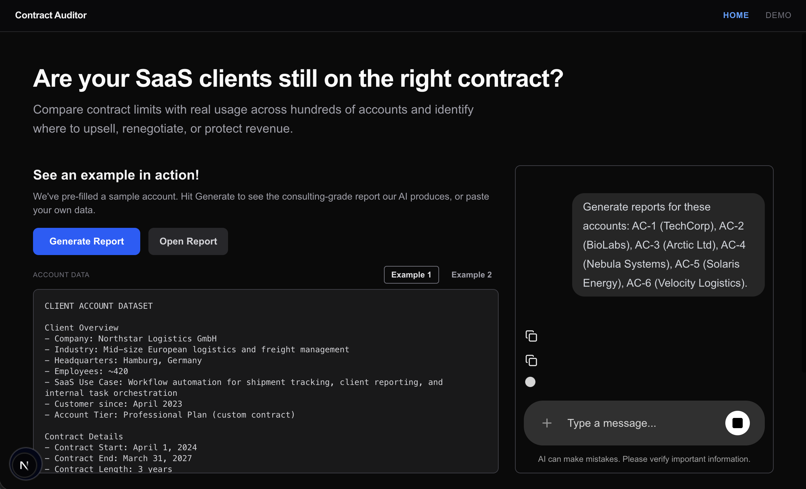
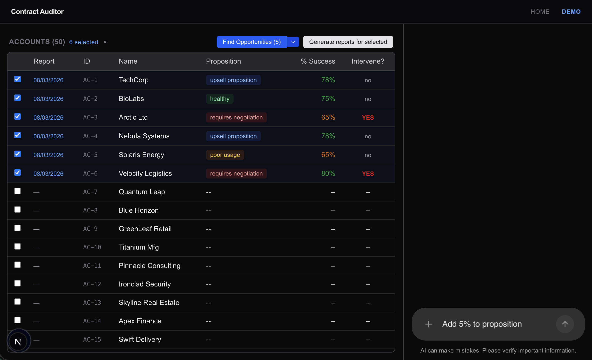
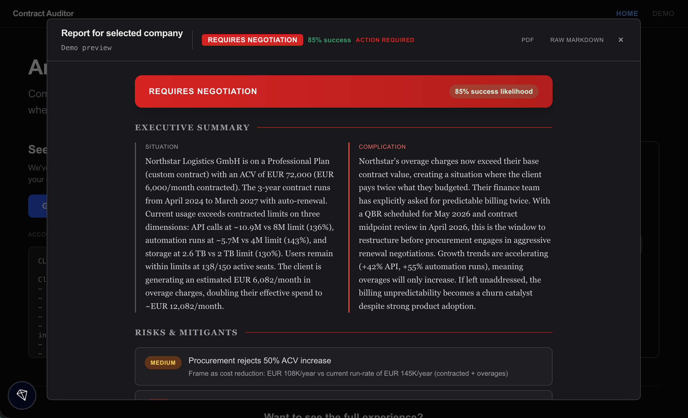
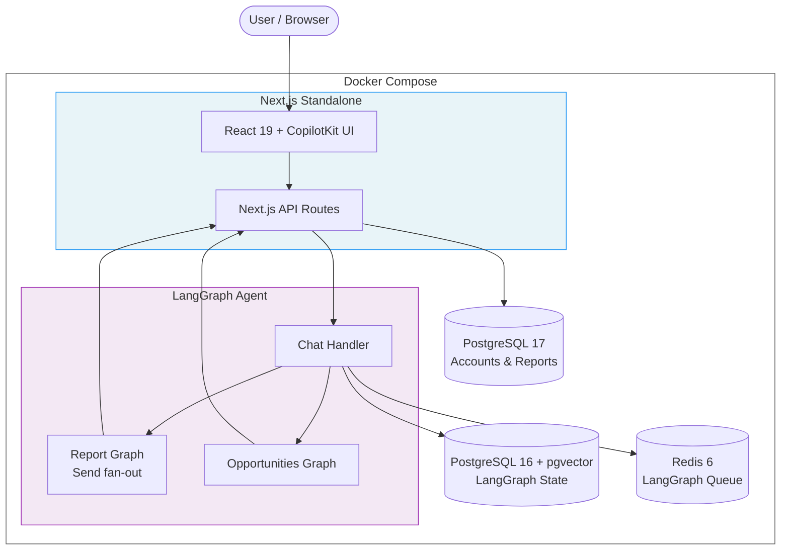

# Contracts Auditor

[](https://github.com/saxxi/contracts_auditor/actions/workflows/ci.yml)
[](LICENSE)
[](https://www.python.org/)
[](https://nodejs.org/)

**[View the project website](https://saxxi.github.io/contracts_auditor/)**

An AI-powered tool that helps SaaS companies identify revenue opportunities hidden in their client contracts. It compares contract limits against actual usage data to surface accounts that are ready for upsell, need renegotiation, or show signs of churn risk.

Built for account executives, customer success teams, and revenue operations at any B2B SaaS company managing a portfolio of client contracts.

### Homepage


### Demo Dashboard


### Report Detail


## What It Does

- **Paste or load account data** (usage metrics, contract terms, billing info) and get a consulting-grade report with strategic recommendations
- **Analyze accounts in bulk** across your portfolio to find the best opportunities
- **Generate reports** that include situation analysis, risk assessment, objection handlers, and next steps
- **Chat with the AI** about any account or report to refine the analysis
- **Edit reports interactively** before sharing with your team

Reports classify each account into categories like "upsell proposition", "requires negotiation", "poor usage", "at capacity", or "healthy" with a success probability score and a flag for whether immediate intervention is needed.

## Architecture



The agent uses LangGraph's `Send()` API to fan out report generation across multiple accounts in parallel, then collects results via state reducers. No external queue needed; the graph runtime handles concurrency.

For a deeper walkthrough of the pipeline, data flow, and parallelism strategy, see the [full architecture page](https://saxxi.github.io/contracts_auditor/architecture.html).

## Tech Stack

- **Frontend**: Next.js 16 (Turbopack), React 19, Tailwind CSS 4, Recharts
- **AI Agent**: LangGraph (Python) with CopilotKit integration
- **Database**: PostgreSQL with Drizzle ORM
- **Monorepo**: Turborepo with pnpm

## Prerequisites

- Node.js 18+
- Python 3.12+
- PostgreSQL
- pnpm
- OpenAI API key

## Quick Start with Docker

The fastest way to run everything:

```bash
cp .env.example .env
# Edit .env and set OPENAI_API_KEY

docker compose up -d --build

# Apply DB schema and seed data (first run only)
docker compose exec app pnpm db:push
docker compose exec app pnpm db:seed
```

The app is now running at [http://localhost:3000](http://localhost:3000).

To stop:
```bash
docker compose down       # Keep data
docker compose down -v    # Remove data volumes
```

### Docker Architecture

| Service | Image | Port |
|---------|-------|------|
| `app` | Next.js standalone | 3000 |
| `app-postgres` | postgres:17-alpine | 5432 |
| `langgraph-api` | langchain/langgraph-api:3.12 (Wolfi) | 8123 |
| `langgraph-postgres` | pgvector/pgvector:pg16 | 5433 |
| `langgraph-redis` | redis:6 | internal |

## Local Development

1. Install dependencies:
```bash
pnpm install
```

2. Set up environment variables:
```bash
cp .env.example .env
```

Edit `.env` and add your keys:
```
OPENAI_API_KEY=your-openai-api-key
DATABASE_URL=postgresql://postgres@localhost:5432/contracts_auditor
```

3. Set up the database:
```bash
psql -U postgres -c "CREATE DATABASE contracts_auditor"
pnpm --filter @repo/app db:push
pnpm --filter @repo/app db:seed
```

4. Start the development server:
```bash
pnpm dev
```

This starts both the Next.js UI (frontend) and the LangGraph agent (backend) concurrently.

## Available Scripts

| Command | Description |
|---------|-------------|
| `pnpm dev` | Start both UI and agent servers |
| `pnpm dev:app` | Start only the Next.js UI |
| `pnpm dev:agent` | Start only the LangGraph agent |
| `pnpm build` | Build for production |
| `pnpm test` | Run unit tests |
| `pnpm --filter @repo/app db:push` | Push schema to database |
| `pnpm --filter @repo/app db:seed` | Seed accounts and historical deals |

## Tests

```bash
# Frontend unit tests
pnpm --filter app test

# Frontend e2e tests (requires build + Chromium)
pnpm --filter app build
pnpm --filter app exec playwright install chromium
pnpm --filter app test:e2e

# Agent tests
cd apps/agent && uv run pytest
```

## Project Structure

```
apps/
  app/          # Next.js frontend
  agent/        # LangGraph Python agent
docker/         # Dockerfiles for app and agent
docs/           # Plans, lessons learned, reference material
evaluation/     # Agent evaluation harness (dataset + accuracy tests)
scripts/        # Benchmark and utility scripts
```

## Architecture Decisions

Design decisions are recorded as numbered plans in [`docs/plans/`](docs/plans/). Each plan documents the problem, approach considered, tradeoffs, and outcome. Examples:

- [001 - Frontend architecture](docs/plans/000000001_frontend_contracts_auditor.md)
- [005 - Report generation agent](docs/plans/000000005_report_generation_agent.md)
- [016 - Flexible account data model](docs/plans/000000016_flexible_account_data_model.md)
- [025 - Docker deployment](docs/plans/000000025_docker_deployment.md)

Ongoing implementation decisions and lessons learned are tracked in [`docs/lessons_learned/decisions.md`](docs/lessons_learned/decisions.md), a running log of what worked, what didn't, and why specific approaches were chosen.

## Observability

The agent emits structured JSON logs for every operation. Each log entry includes a request ID, timing, and relevant context:

```
{"event":"report_start","request_id":"a1b2c3","account_id":"AC-1","timestamp":"..."}
{"event":"report_complete","request_id":"a1b2c3","account_id":"AC-1","duration_ms":1842,"proposition_type":"upsell proposition","success_percent":75,"intervene":false}
```

Logs are written to stderr via Python's `logging` module. In Docker, they're captured by the container runtime. Set `LOG_LEVEL=DEBUG` for verbose output including cache hits and API call timing.

## Development Approach

This project was built with AI-assisted development (Claude Code). LLMs were used to accelerate scaffolding, boilerplate, and iterative refinement. The focus of the repository is on architecture, system design, and product thinking. The [`docs/plans/`](docs/plans/) folder and [`docs/lessons_learned/`](docs/lessons_learned/) folder document the actual decision-making process.

## License

Dual-licensed under AGPL-3.0 and a commercial license. See [LICENSE](LICENSE) and [LICENSE-COMMERCIAL.md](LICENSE-COMMERCIAL.md) for details.

## Troubleshooting

**Agent connection issues**: Make sure the LangGraph agent is running on port 8000 and your OpenAI API key is set correctly.

**Database reset** (local):
```bash
psql -U postgres -c "DROP DATABASE contracts_auditor"
psql -U postgres -c "CREATE DATABASE contracts_auditor"
pnpm --filter @repo/app db:push
pnpm --filter @repo/app db:seed
```

**Database reset** (Docker):
```bash
docker compose down -v
docker compose up -d
docker compose exec app pnpm db:push
docker compose exec app pnpm db:seed
```

**Python dependencies**:
```bash
cd apps/agent && pip install -e .
```
