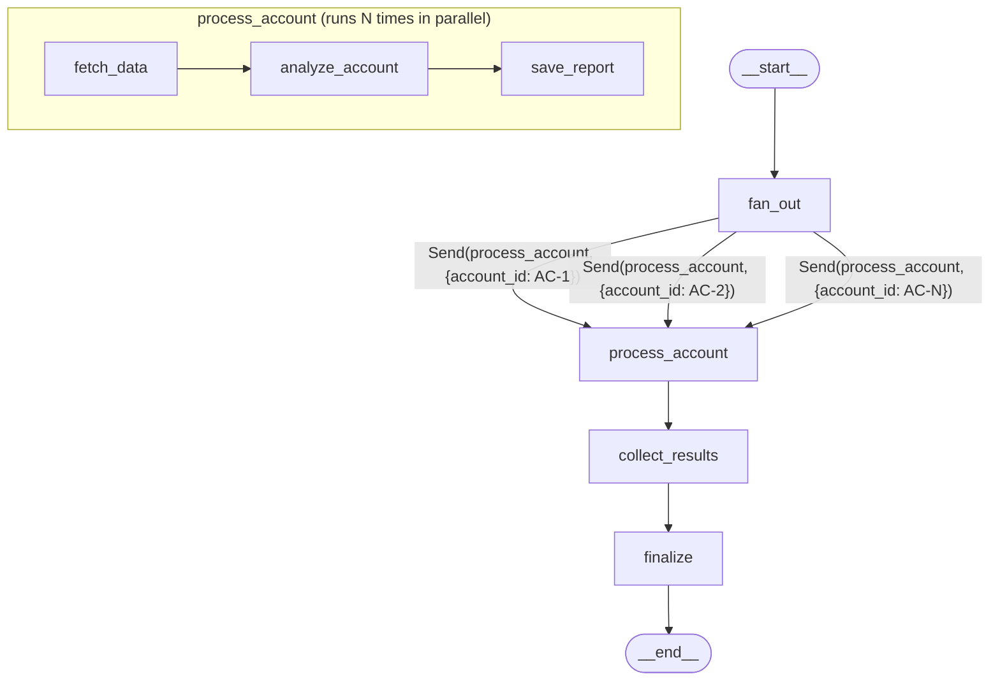

# Plan: LangGraph Report Generation Agent

## Context

Report generation is currently mock (`generateMockReport()` in `mock-db.ts`). This plan replaces it with a LangGraph StateGraph pipeline using parallel `Send()` fan-out: data fetching, LLM analysis, HTML conversion, and saving — all as visible graph nodes.

---

## Graph: Parallel Send() Fan-Out



- `fan_out` emits one `Send()` per account ID
- Each fork runs independently: fetch → analyze (LLM) → save (POST to API)
- Results merge back via `operator.add` reducer on `results` and `errors` lists
- If `fetch_data` gets no summary: appends error, skips analyze/save for that fork
- Total time: ~1x (fetch + LLM + save) regardless of N accounts

---

## Decisions

- **Parallel processing** via `Send()` fan-out
- **Subgraph invoked from tool** — `generate_reports` tool builds + invokes the StateGraph
- **After batch: no modal** — chat shows summary (account name, type, %, intervene), table updates. User opens individual reports from table
- **Chat context persists** — opening a single report doesn't clear batch context. `focused_account_id` is set so agent knows which report is visible, but batch knowledge stays in message history
- **Reports only in modal** — chat is conversational/talkative, never dumps large text. Agent always opens modal before showing report changes
- **Batch edits require modal** — if user says "make AC-1 more aggressive", agent sets `focused_account_id` to open modal, applies change there. Then asks "looks good? apply to others?"
- **Batch tracking** — no new field. Agent uses existing `account_reports` list (status="generated") to know which reports it can discuss
- Python agent calls Next.js REST API for data (not direct DB)
- LLM outputs markdown, Python converts to HTML before saving
- File-based JSON cache (`apps/agent/.cache/`), TTL 1 day dev / 10 min prod
- Skip failed accounts, report error in chat, continue with remaining

---

## StateGraph Design

### State Schema

```python
class ReportGraphState(TypedDict):
    account_ids: list[str]                              # input: accounts to process
    results: Annotated[list[dict], operator.add]        # reducer: {account_id, report} per fork
    errors: Annotated[list[str], operator.add]          # reducer: error messages per fork

class ProcessAccountState(TypedDict):
    account_id: str                  # single account being processed
    account_summary: dict | None     # fetched from /api/account_summaries
    historical_deals: list[dict]     # filtered top 5-8 relevant deals
    report_html: str | None          # markdown converted to HTML
    report_metadata: dict | None     # {proposition_type, success_percent, intervene}
    saved_report: dict | None        # API response from POST
```

### Nodes

1. **`fan_out`** — Reads `account_ids`, returns list of `Send("process_account", {"account_id": id})` for each
2. **`fetch_data`** (subgraph) — GET summary + historical deals (both file-cached). Filters top 5-8 deals by tier/outcome/deal size. If no summary: adds to `errors`, returns early
3. **`analyze_account`** (subgraph) — LLM call with REPORT_ANALYZER_PROMPT. Parses metadata JSON from last line. Converts markdown→HTML via Python `markdown` lib
4. **`save_report`** (subgraph) — POST to `/api/accounts/{id}/account_reports`. Appends `{account_id, report}` to parent `results`
5. **`collect_results`** — No-op; results auto-merged via reducer
6. **`finalize`** — No-op; graph returns final state

### Edges

```
START → fan_out → [Send per account] → process_account → collect_results → finalize → END

Within process_account:
  fetch_data →|ok| analyze_account → save_report
  fetch_data →|no data| (error added, fork ends)
```

---

## Agent State & Chat Behavior

### Agent State

```python
class AgentState(BaseAgentState):
    account_reports: list[AccountReport]    # all selected accounts + their status
    focused_account_id: str | None          # which report modal is currently open
    report_manually_edited: bool            # flag: user edited report in TipTap
    report_latest_content: str | None       # latest HTML from TipTap (for edit awareness)
```

No `active_batch_ids` — agent uses `account_reports` with `status="generated"` + message history for batch context.

### Chat Modes

| Trigger | Chat behavior |
|---------|---------------|
| **Batch generation completes** | No modal. Chat shows talkative summary: account names, proposition types, success %, intervene flags. Asks "which accounts would you like to discuss?" |
| **User opens report from table** | `focused_account_id` set. Chat keeps all prior context (batch or otherwise). Agent knows which report is visible |
| **User asks to edit in batch context** | Agent sets `focused_account_id` to open that account's modal, applies change, asks "looks good? apply to others?" |
| **User closes modal** | `focused_account_id` cleared. Chat context preserved |
| **New generation triggered** | Chat messages cleared. Fresh start |

### Chat Summary Format (after batch generation)

Agent message style — talkative, no large text blocks:

> Generated reports for 3 accounts:
>
> **TechCorp** (AC-1) — requires negotiation, 90% success, intervention needed
> **ABC Ltd** (AC-2) — upsell proposition, 70% success
> **QQQ Company** (AC-3) — poor usage, 30% success, intervention needed
>
> Two accounts need immediate attention. Want me to walk you through the recommendations?

---

## Prompts

### 1. Main Agent System Prompt (`main.py`)

This is the system prompt for the ReAct agent that orchestrates everything. It never generates reports itself — it calls tools.

```
You are a contracts auditor assistant for a SaaS company. You help users identify
which client accounts are eligible for upsell, require contract renegotiation, or
are at risk of churning.

## Your tools
- select_accounts: move accounts to the Selected table for review
- generate_reports: generate LLM-powered reports for selected accounts (parallel)
- get_report_content: fetch latest report content (use before editing)
- update_report: modify a report based on user instructions
- get_account_reports: get current selection/report state

## Behavior rules

CHAT STYLE:
- Be conversational and talkative. Short paragraphs, not walls of text.
- NEVER paste report content into chat. Reports belong in the modal editor.
- Use bold for account names and key numbers.
- When summarizing reports, use one line per account: name, type, %, intervene flag.

AFTER BATCH GENERATION:
- Summarize all generated reports conversationally (one line per account).
- Highlight which accounts need intervention.
- Ask the user what they'd like to explore or adjust.
- Do NOT open any modal (do not set focused_account_id).

WHEN USER ASKS TO EDIT A REPORT:
- If no modal is open: set focused_account_id to open that account's modal first.
- Always call get_report_content BEFORE update_report (user may have edited manually).
- After updating one report, ask: "Looks good? Should I apply similar changes to the others?"

WHEN MODAL IS OPEN (focused_account_id is set):
- You are in report discussion mode for that specific account.
- If user says "this report" or "update it", they mean the focused account.
- Keep batch context — user can still ask about other accounts.

FIND OPPORTUNITIES:
- Analyze account data: usage vs limits, payment status, renewal timeline, utilization.
- Use select_accounts to recommend the top opportunities.
- Explain reasoning briefly per account.
```

### 2. Report Analyzer Prompt (`prompts.py` — REPORT_ANALYZER_PROMPT)

Sent to the LLM inside the `analyze_account` graph node. One call per account.

**Example with hardcoded data (AC-6 Velocity Logistics):**

```
You are a senior contracts auditor at a SaaS company. Analyze this account and
produce a dense, actionable report.

## Account Data
{
  "id": "AC-6",
  "active_users_report": { "active_users": 105, "seat_limit": 100 },
  "invoicing_usage_report": { "monthly_invoices": 510, "invoice_limit": 500 },
  "integrations_usage_report": { "active_integrations": 12, "integration_limit": 10 },
  "budget_report": {
    "mrr": 4500,
    "contract_value": 54000,
    "tier": "Growth",
    "renewal_in_days": 5,
    "payment_status": "current"
  }
}

## Relevant Historical Deals
[
  {
    "deal_id": "D-001",
    "industry": "SaaS / Developer Tools",
    "company_size": "51-200",
    "original_tier": "Growth",
    "proposed_tier": "Enterprise",
    "deal_size_usd": 96000,
    "pitch_type": "usage-ceiling",
    "pitch_summary": "Showed customer they were hitting seat limit monthly; framed Enterprise as removing growth friction.",
    "main_objections": ["price jump too large", "needs CFO sign-off"],
    "objection_handling": "Offered 2-month free trial on Enterprise tier; looped in their CFO with an ROI one-pager.",
    "outcome": "won",
    "time_to_close_days": 22,
    "notes": "ROI framing was key. Pure feature pitch had failed 3 months prior."
  },
  {
    "deal_id": "D-004",
    "industry": "FinTech",
    "company_size": "51-200",
    "original_tier": "Growth",
    "proposed_tier": "Enterprise",
    "deal_size_usd": 110400,
    "pitch_type": "usage-ceiling",
    "pitch_summary": "Invoice volume was at 94% of limit. Projected breach date shown in demo.",
    "main_objections": ["wants multi-year discount", "legal review on DPA"],
    "objection_handling": "15% discount on 2-year commit; fast-tracked DPA with legal team.",
    "outcome": "won",
    "time_to_close_days": 30,
    "notes": "Showing a projected breach date created urgency without pressure."
  },
  {
    "deal_id": "D-003",
    "industry": "E-commerce",
    "company_size": "11-50",
    "original_tier": "Growth",
    "proposed_tier": "Enterprise",
    "deal_size_usd": 72000,
    "pitch_type": "renewal-upsell",
    "pitch_summary": "Timed expansion proposal to 30 days before renewal. Bundled extra invoice volume.",
    "main_objections": ["already locked budget for year", "not enough feature delta"],
    "objection_handling": "Offered to lock current pricing for 2 years if they upgraded now.",
    "outcome": "lost",
    "time_to_close_days": 18,
    "notes": "Budget was genuinely frozen. Should have surfaced this 90 days out, not 30."
  }
]

## Instructions

Analyze this account across these dimensions:
1. **Usage vs limits** — seats, invoices, integrations utilization rates
2. **Financial health** — MRR, contract value, payment status
3. **Renewal timeline** — urgency based on days until renewal
4. **Historical context** — similar deals, what worked, what objections arose

Classify the account into exactly one proposition type:
- "requires negotiation" — over any limit, must renegotiate terms
- "upsell proposition" — near limits (>85% avg utilization), strong growth signal
- "poor usage" — low utilization (<30%) or overdue payment, churn risk
- "at capacity" — high utilization (>85%) but not over limits
- "healthy" — balanced usage, no immediate action needed

## Output Format

Write the report in markdown with these sections:

### Executive Summary
2-3 sentences. Lead with the number. Bloomberg terminal style — dense, no filler.

### Account Health Snapshot
Key metrics table in markdown. Include utilization percentages.

### Recommendation
What action to take and why. Be specific about tier changes, pricing, outreach timing.

### Pitch Strategy
Based on historical deals data, what pitch approach has worked for similar accounts.
Reference specific deal outcomes.

### Risk Factors
What could go wrong. Be honest about downside scenarios.

### Next Steps
Numbered list of concrete actions with owners and timelines relative to renewal date.

---

On the VERY LAST LINE of your response, output a JSON object with metadata
(no markdown formatting on this line):
{"proposition_type": "<one of the types above>", "success_percent": <0-100>, "intervene": <true/false>}

Rules for metadata:
- success_percent: likelihood this engagement succeeds (consider historical deal outcomes)
- intervene: true if renewal_in_days <= 30 OR payment is overdue OR over any limit
```

**Expected LLM output (example):**

```markdown
### Executive Summary

Velocity Logistics is breaching all 3 contract limits — 105/100 seats (105%),
510/500 invoices (102%), 12/10 integrations (120%) — with renewal in 5 days.
$4,500 MRR ($54K ACV) on Growth tier, payment current. Immediate renegotiation
required before auto-renewal locks suboptimal terms.

### Account Health Snapshot

| Metric | Current | Limit | Utilization |
|--------|---------|-------|-------------|
| Seats | 105 | 100 | 105% |
| Invoices | 510 | 500 | 102% |
| Integrations | 12 | 10 | 120% |
| MRR | $4,500 | — | — |
| Renewal | 5 days | — | URGENT |
| Payment | Current | — | OK |

### Recommendation

Upgrade to Enterprise tier immediately. Current Growth plan cannot accommodate
usage. Target ACV: $96K-$110K based on comparable deals (D-001, D-004). Given
5-day runway, propose emergency bridge: extend current terms 30 days at pro-rated
Enterprise pricing while formal contract is processed.

### Pitch Strategy

D-001 (won, 22 days): Usage-ceiling pitch showing seat limit breach monthly —
directly applicable. ROI framing beat feature pitch. D-004 (won, 30 days):
Projected breach date demo created urgency. Both Growth→Enterprise, both won.
D-003 (lost, 18 days) warns against pure renewal-timing — budget freeze killed
it. Key: lead with usage data, not features. Prepare ROI one-pager for CFO
sign-off objection (appeared in D-001).

### Risk Factors

- 5-day window is extremely tight. If auto-renewal triggers at Growth terms,
  we're locked for another cycle at $54K while delivering Enterprise-level usage.
- CFO sign-off (D-001 pattern) may not be achievable in 5 days.
- Customer may push back on price jump — Growth to Enterprise is ~2x.

### Next Steps

1. **Today (R-5):** Account manager calls customer, presents usage breach data
2. **Today (R-5):** Send ROI one-pager + Enterprise vs Growth comparison
3. **R-4:** Escalate to VP Sales if no response — this is a $50K+ expansion
4. **R-3:** If customer needs time, propose 30-day bridge extension
5. **R-1:** Final decision checkpoint — either signed or bridge in place

{"proposition_type": "requires negotiation", "success_percent": 82, "intervene": true}
```

### 3. Report Update Prompt (`prompts.py` — REPORT_UPDATE_PROMPT)

Sent when user asks agent to modify an existing report.

**Example with hardcoded data:**

```
You are a senior contracts auditor. The user wants to modify an existing report.

## Current Report Content (HTML)
<h3>Executive Summary</h3>
<p>Velocity Logistics is breaching all 3 contract limits — 105/100 seats (105%),
510/500 invoices (102%), 12/10 integrations (120%) — with renewal in 5 days.
$4,500 MRR ($54K ACV) on Growth tier, payment current.</p>
<h3>Recommendation</h3>
<p>Upgrade to Enterprise tier immediately. Target ACV: $96K-$110K.</p>
...

## User's Requested Changes
Make the pitch strategy more aggressive. Emphasize the cost of inaction — what
happens if they don't upgrade and hit hard limits.

## Instructions

Apply the requested changes to the report. Maintain the same structure and style
(Bloomberg terminal style — dense, numbers-first).
Output the FULL updated report in markdown format.

On the VERY LAST LINE, output the updated metadata JSON (same format as original):
{"proposition_type": "<type>", "success_percent": <0-100>, "intervene": <true/false>}

Only change what the user asked for. Keep everything else intact.
```

---

## Implementation Steps

### 1. Already done (OK as-is)

- `apps/app/src/app/api/historical_deals/route.ts` — GET endpoint
- `apps/app/src/lib/mock-db.ts` — `getHistoricalDeals()`, `createReportFromData()`
- `apps/agent/src/cache.py` — file cache with TTL
- `apps/agent/src/prompts.py` — REPORT_ANALYZER_PROMPT + REPORT_UPDATE_PROMPT
- `apps/agent/.gitignore` — `.cache/` added
- `apps/agent/pyproject.toml` — `markdown`, `httpx` added
- `apps/app/src/app/api/accounts/[account_id]/account_reports/route.ts` — accepts agent data
- `apps/app/src/app/api/account_reports/[id]/route.ts` — PUT accepts metadata

### 2. Rewrite: `apps/agent/src/report_graph.py`

Full StateGraph with `Send()`-based parallel fan-out. Export `build_report_graph()` returning a compiled graph.

Keep existing helper functions (`_fetch_account_summary`, `_fetch_historical_deals`, `_filter_relevant_deals`, `_parse_report_metadata`, `_extract_report_body`, `_save_report`).

Replace `generate_report_for_account()` and `generate_reports_pipeline()` with the StateGraph nodes.

### 3. Rewrite: `apps/agent/src/contracts.py`

- `generate_reports` tool: invoke `build_report_graph()` with `{"account_ids": [...]}`, read `results`/`errors` from final state
- After completion: **do not set `focused_account_id`** — return `Command` with updated `account_reports` statuses and a talkative summary message (account names, types, percentages)
- `update_report` tool: sets `focused_account_id` before applying changes (opens modal)
- Keep `get_report_content`, `select_accounts`, `get_account_reports` as-is

### 4. Update: `apps/agent/main.py`

System prompt update to reflect:
- After batch generation: summarize results conversationally, don't open modal
- When user asks to edit a specific report: set `focused_account_id` first
- Never dump large report text into chat
- When batch editing: apply to one account first, ask user to confirm, then apply to rest

### 5. Frontend: `contracts-canvas.tsx`

- `handleGenerateReport` (single) / `handleGenerateMissing` (batch): clear messages → send agent message with account IDs → run agent
- **Remove**: auto-opening modal after generation (agent doesn't set `focused_account_id` for batch)
- Watch `focused_account_id` in agent state → open/close modal accordingly
- **Don't clear chat** when modal opens (preserve batch context)
- Only clear chat when starting a new generation

### 6. Frontend: `report-modal.tsx`

- On TipTap `onUpdate`: push `report_manually_edited: true` + latest content to agent state
- CopilotKit suggestions when modal is open:
  - "Make the pitch more aggressive"
  - "Expand on risk factors"
  - "Increase success estimate"
  - "Add competitive positioning"

---

## Files Summary

| File | Action | What |
|------|--------|------|
| `apps/agent/src/report_graph.py` | REWRITE | StateGraph with Send() parallel fan-out |
| `apps/agent/src/contracts.py` | REWRITE | `generate_reports` invokes StateGraph, talkative summary |
| `apps/agent/main.py` | MODIFY | System prompt: batch context, no large text in chat |
| `apps/app/src/components/contracts/contracts-canvas.tsx` | MODIFY | Route generation through agent, no auto-modal |
| `apps/app/src/components/contracts/report-modal.tsx` | MODIFY | Edit awareness + suggestions |

---

## Verification

1. `pnpm dev` + `langgraph dev`
2. Select 3 accounts → "Generate missing reports" → all reports generated in parallel, **no modal opens**, chat shows conversational summary with all 3 accounts
3. Click "Generated [open]" on one account → modal opens, chat keeps batch context
4. In chat: "compare AC-1 and AC-2" → agent responds conversationally (no large text)
5. In chat: "make AC-1 more aggressive" → agent opens AC-1 modal, applies change, asks "apply to others?"
6. Single "Generate..." → same pipeline, 1 Send, chat shows single account summary
7. Edit in TipTap → agent state gets `report_manually_edited: true`
8. Chat "update this report" (with modal open) → agent fetches latest (including manual edits), updates via API
9. Generate for non-existent account → error in chat, other accounts succeed
10. Check `apps/agent/.cache/` for cached JSON files
